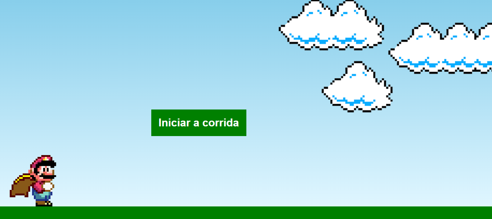

# JOGO DO MARIO
☑️JOGO EM HTML/CSS/JS.

   

## DESCRIÇÃO:
Este é um jogo simples em que um personagem (representado por uma imagem de Mario) deve pular sobre um obstáculo (representado por um cano) enquanto avança automaticamente para a direita.

- `startGame()`: Inicia o jogo, adicionando a animação ao cano, escondendo o botão de início e iniciando a reprodução do áudio de início.
- `restartGame()`: Reinicia o jogo, escondendo a tela de game over, reposicionando o Mario e o cano, e reiniciando a reprodução do áudio de início.
- `loop()`: Define um intervalo para verificar continuamente a posição do cano e do Mario. Se houver colisão entre o Mario e o cano, a reprodução do áudio é alterada para o de game over, a animação é interrompida, e a tela de game over é exibida.
- Adiciona ouvintes de eventos de pressionamento de tecla e toque para permitir que o jogador controle o Mario. Pressionar a barra de espaço ou tocar na tela faz com que o Mario pule, enquanto pressionar a tecla Enter inicia o jogo.

## NÃO SABE?
- Entendemos que para manipular arquivos em `HTML`, `CSS` e outras linguagens relacionadas, é necessário possuir conhecimento nessas áreas. Para auxiliar nesse aprendizado, oferecemos cursos gratuitos disponíveis:
* [CURSO DE CANVAS](https://github.com/VILHALVA/CURSO-DE-CANVAS)
* [CURSO DE HTML E CSS](https://github.com/VILHALVA/CURSO-DE-HTML-E-CSS)
* [CURSO DE JAVASCRIPT](https://github.com/VILHALVA/CURSO-DE-JAVASCRIPT)
* [CONFIRA MAIS CURSOS](https://github.com/VILHALVA?tab=repositories&q=+topic:CURSO)

## CREDITOS:
- [PROJETO CRIADO PELO "EvanderInacio"](https://github.com/EvanderInacio/Mario)
- [PROJETO EDITADO PELO VILHALVA](https://github.com/VILHALVA)
